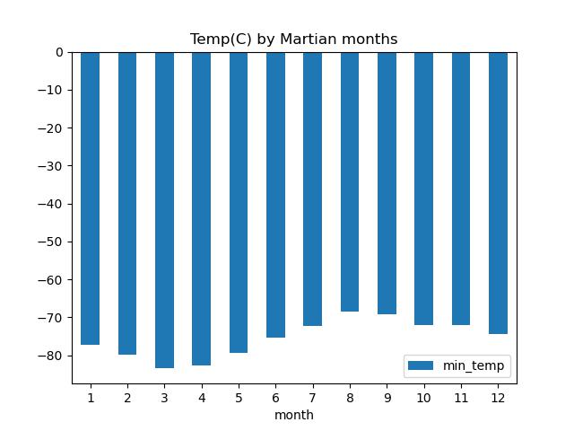
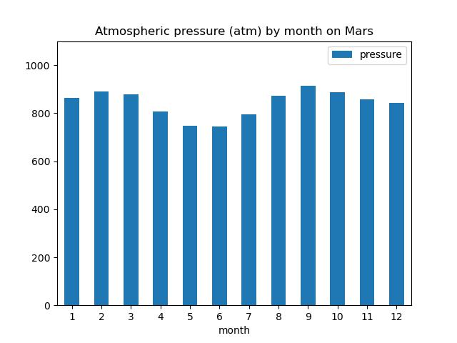
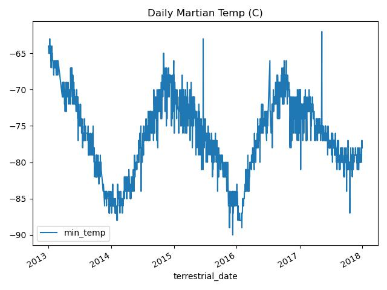

# Mars-Scraping

## Overview
The client would like to trend weather and related data from the mission to Mars website. In order to do so, we have been contracted to scrape the data from the website https://redplanetscience.com/. With the retrieved data, we can organize, analyze, and visualize to communicate insights.

## Purpose
To analyze the data retrieved from the mission to Mars.

## Results & Analysis
The HTML table was extracted from the website and added into a pandas dataframe named [mars_df](Analysis/missiontomars.csv). Once in the dataframe, the entries were converted from object to the appropriate data type. We were then able to answer the following questions:

1. How many months exist on Mars?

By using the describe function, we can see that there are 12 months on Mars as the maximum number under the month column is 12.

2. How many Martian days worth of data exist in the scraped dataset?

The sol column shows the number of elapsed days since curiosity has landed on Mars. Looking at the count under this column shows that there are 1,867 days worth of data.

3. What are the coldest and warmest months on Mars? 

In a new dataframe, avg_temp_df, the mars_df dataframe was grouped by month and the mean function was applied. With the new dataframe, a bar chart was plotted to visualize the average min_temp per Martian month. From the bar chart shown below, the third Martian month is the coldest (-85C) and the eighth Martian month is the warmest (-65C).

4. Which months have the lowest and highest atmospheric pressure on Mars? 

From the same dataframe, a bar chart was plotted to visualize the monthly atmospheric pressure on Mars using the average of the pressure data. From the chart shown below, it can be seen that Martian month 5 and 6 have the lowest atmospheric temperature (approximately 700atm). Martian month 9 has the highest atmospheric temperature at around 900atm.

5. About how many terrestrial days exist in a Martian year? 

A year is defined as one full revolution around the Sun. Thus, to determine the amount of terrestrial days in a Martian year, we used the assumption that the temperature pattern would be similar to Earth's, where lower temperatures are seen during winter and higher temperatures, during summer. Using this assumption, a full year would then go from one low peak to the next. 

To better visualize this temperature pattern, a new dataframe was created to hold the terrestrial_date and min_temp columns. These were plotted in a line chart (shown below). From this chart, we can see that a low peak starts around the year 2014 and another low peak occurs around 2016. It can then be estimated that a Martian year is approximately equivalent to two Earth years or 730 days.

## Summary
By scraping the https://redplanetscience.com/ for Mars data, we were able to trend the weather data received from the Curiosity rover. The data gathered was into a pandas DataFrame to easily analyze and plot the values into charts. 

Using the describe function, this dataset suggests that 12 months exist on Mars and 1,867 number of entries were available from the project. 

The mean of temperature and atmospheric pressure was calculated by Martian month and a bar chart was plotted to determine the month's with the lowest and highest temperature and atmospheric pressure on Mars.

Plotting the terrestrial days against the min_temp enabled us to estimate the number of terrestrial days on Mars. The data suggests there is approximately 730 days (or 2 Earth years) on Mars.
